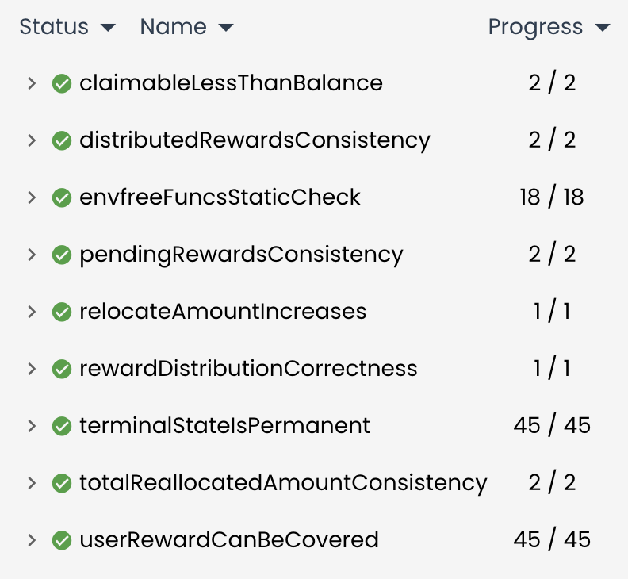

# Nudge.xyz Formal Verification Report by [slvDev](https://x.com/slvDev)

## Methodology

The formal verification process employs the following approach:

1. **Rules**:
   A rule is a verification task possibly containing assumptions, calls to the relevant
   functionality that is symbolically executed and assertions that are verified on any resulting states
   from the computation.

2. **Inductive Invariants**:
   Inductive invariants are proved by induction on the structure of a smart
   contract. We use constructors/init() functionality as a base case, and consider all other
   (relevant) externally callable functions as step cases.
   Specifically, to prove the base case, we show that a property holds in any resulting state after a
   symbolic call to the respective initialization function. For proving step cases, we generally
   assume a state where the invariant holds (induction hypothesis), symbolically execute the
   functionality under investigation, and prove that after this computation any resulting state
   satisfies the invariant. Each such case results in one rule.

### General Assumptions

**Loop Handling**:

- Certora handles loops by unrolling them a specific number of times
- Maximum loop iteration limit is set to 2 for verification

## Verification Results



## P-01. Solvency and Balance Integrity

**Status**: Verified (2/2)
**Assumptions**: Standard ERC20 token implementation

| Rule Name                | Status   | Description                                                                          |
| ------------------------ | -------- | ------------------------------------------------------------------------------------ |
| claimableLessThanBalance | Verified | Contract maintains sufficient reward tokens to cover pending rewards and fees        |
| userRewardCanBeCovered   | Verified | Individual user rewards can be covered by contract balance after accounting for fees |

```
rule claimableLessThanBalance() {
    assert getBalanceOfSelf(rewardToken()) >= pendingRewards() + accumulatedFees();
}

rule userRewardCanBeCovered(env e, method f, calldataarg args) {
    uint256 pID;
    uint256 rewardAmount = getParticipationRewardAmount(pID);
    require rewardAmount <= getBalanceOfSelf(rewardToken()) - (pendingRewards() - rewardAmount) - accumulatedFees();
    f(e, args);
    uint256 rewardAmountAfter = getParticipationRewardAmount(pID);
    assert rewardAmountAfter <= getBalanceOfSelf(rewardToken()) - (pendingRewards() - rewardAmountAfter) - accumulatedFees();
}
```

## P-02. State Consistency

**Status**: Verified (6/6)
**Assumptions**: None

| Rule Name                         | Status   | Description                                                            |
| --------------------------------- | -------- | ---------------------------------------------------------------------- |
| totalReallocatedAmountConsistency | Verified | Sum of all participation `toAmount` equals to `totalReallocatedAmount` |
| pendingRewardsConsistency         | Verified | `pendingRewards` equals sum of all PARTICIPATING rewards               |
| distributedRewardsConsistency     | Verified | `distributedRewards` equals sum of all CLAIMED rewards                 |

```
invariant totalReallocatedAmountConsistency()
    currentContract.totalReallocatedAmount == sumToAmounts;

invariant pendingRewardsConsistency()
    currentContract.pendingRewards == sumPendingRewards;

invariant distributedRewardsConsistency()
    currentContract.distributedRewards == sumDistributedRewards;
```

## P-03. Participation State Transitions

**Status**: Verified (46/46)
**Assumptions**: None

| Rule Name                     | Status   | Description                                                       |
| ----------------------------- | -------- | ----------------------------------------------------------------- |
| terminalStateIsPermanent      | Verified | CLAIMED/INVALIDATED/HANDLED_OFFCHAIN states are permanent         |
| rewardDistributionCorrectness | Verified | Rewards are correctly distributed and state transitions are valid |

```
rule terminalStateIsPermanent(env e, method f, calldataarg args) {
    uint256 pID;
    require pID <= currentContract.pID;
    IBaseNudgeCampaign.ParticipationStatus statusBefore = getParticipationStatus(pID);
    require statusBefore == CLAIMED() || statusBefore == INVALIDATED() || statusBefore == HANDLED_OFFCHAIN();
    f(e, args);
    IBaseNudgeCampaign.ParticipationStatus statusAfter = getParticipationStatus(pID);
    assert statusAfter == statusBefore, "Terminal state must be changed";
}

rule rewardDistributionCorrectness(env e) {
    uint256[] pIDs;
    require pIDs.length == 1;
    uint256 pID = pIDs[0];
    IBaseNudgeCampaign.ParticipationStatus status = getParticipationStatus(pID);
    address userAddress = getParticipationUserAddress(pID);
    uint256 rewardAmount = getParticipationRewardAmount(pID);
    require status == PARTICIPATING();
    require userAddress == e.msg.sender && userAddress != 0 && userAddress != currentContract;
    require getBalanceOfSelf(rewardToken()) >= rewardAmount;
    uint256 balanceBefore = getBalanceOfSelf(rewardToken());
    claimRewards(e, pIDs);
    uint256 balanceAfter = getBalanceOfSelf(rewardToken());
    IBaseNudgeCampaign.ParticipationStatus statusAfter = getParticipationStatus(pID);
    assert statusAfter == CLAIMED(), "Status should be CLAIMED after successful claim";
    assert balanceAfter == balanceBefore - rewardAmount, "Contract balance should decrease by reward amount";
}
```

## P-04. Reallocation Integrity

**Status**: Verified (1/1)
**Assumptions**: External calls don't reenter into core functions

| Rule Name               | Status   | Description                                               |
| ----------------------- | -------- | --------------------------------------------------------- |
| relocateAmountIncreases | Verified | Total reallocated amount correctly tracks token movements |

```
rule relocateAmountIncreases(env e) {
    uint256 campaignId_; address userAddress; address toToken; uint256 toAmount; bytes data;
    uint256 relocateAmount_before = totalReallocatedAmount();
    uint256 msgSenderBalanseOf = rewardToken().balanceOf(e, e.msg.sender);
    require userAddress != currentContract && userAddress != 0 && e.msg.sender != currentContract;
    require toAmount + relocateAmount_before <= max_uint256;
    require e.msg.value + relocateAmount_before <= max_uint256;
    handleReallocation(e, campaignId_, userAddress, toToken, toAmount, data);
    uint256 relocateAmount_after = totalReallocatedAmount();
    assert toToken == currentContract.NATIVE_TOKEN() =>
        relocateAmount_after == relocateAmount_before + e.msg.value;
    assert toToken != currentContract.NATIVE_TOKEN() =>
        relocateAmount_after == relocateAmount_before + msgSenderBalanseOf;
}
```

## Executive Summary

The formal verification process has successfully verified critical properties of the Nudge protocol:

1. **Solvency Guarantees**

   - Contract maintains sufficient balance for all rewards and fees
   - Individual user rewards are always covered

2. **State Consistency**

   - All participation amounts are correctly tracked
   - Reward states (pending/distributed) match actual participation statuses

3. **State Machine Integrity**

   - Terminal states are permanent
   - State transitions follow expected patterns

4. **Token Handling**
   - Reallocation amounts are correctly tracked
   - Native and ERC20 token transfers maintain balance integrity

All critical invariants hold under the stated assumptions, demonstrating the mathematical soundness of the protocol's core mechanisms.
